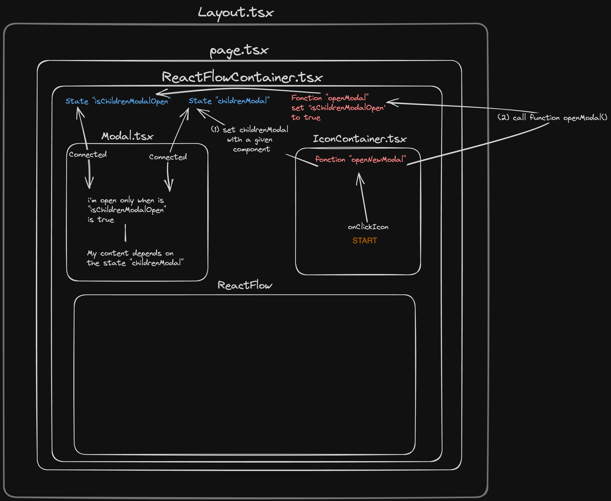

# Introduction

This project is a web application based on react flow (A highly customizable React component for building node-based editors and interactive diagrams).

This project is using Next.js, React.js, Typescript, Tremor and Tailwind.

Despite it is not recommended for clean code, I added few comments in the code to improve the comprenhension for beginners.

## Getting Started

First, install the dependencies with

```bash
npm install
# or
yarn install
# or
pnpm install
```

```bash
npm run dev
# or
yarn dev
# or
pnpm run dev
```

Open [http://localhost:3000](http://localhost:3000) with your browser to see the result.

## Utilisation

In the home page, you can add your own _JSON_ file or start with an exemple and modify it after. (Excel isn't available for the moment).
You can also download the file in two formats : _JSON_ or _Excel (xlsx)_.
You can see at top right a boutton to see all keyboard shortcuts.

---

You can add different types of nodes by clicking on "add node".
If you click on the black circle on each group/node bottom you can create edges between them.

## Learn more

An example about how works the modal.


To learn more about Next.js, take a look at the following resources:

- [Next.js Documentation](https://nextjs.org/docs) - learn about Next.js features and API.
- [Learn Next.js](https://nextjs.org/learn) - an interactive Next.js tutorial.

You can check out [the Next.js GitHub repository](https://github.com/vercel/next.js/) - your feedback and contributions are welcome!

### React Flow

If you're interested in learning more about React Flow, here are some resources to get you started:

- [React Flow Documentation](https://reactflow.dev/docs/getting-started/introduction) - the official documentation for React Flow.
- [React Flow Tutorial](https://www.smashingmagazine.com/2020/09/node-based-editor-react-flow/) - a tutorial on building a node-based editor with React Flow.
- [React Flow Examples](https://github.com/wbkd/react-flow/tree/main/examples) - a collection of examples demonstrating different use cases for React Flow.
- [React Flow Playground](https://reactflow.dev/examples/playground/) - an interactive playground where you can experiment with React Flow.
- [React Flow GitHub Repository](https://github.com/wbkd/react-flow) - the GitHub repository for React Flow, where you can find the source code and contribute to the project.
